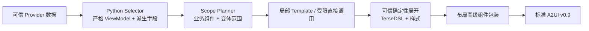

# Widget Service 业务内容高级组件 Wiki

> 当前范围：`advanced-component-ux-registry/1` 注册的全部 17 个业务内容高级组件。
>
> 表达约定：业务组件是服务端生成期语义能力，不是端侧 A2UI Catalog 节点。第二层模型使用已批准的
> 版本化局部 `Template`，或 Registry 明确批准的受限直接业务构造；可信服务端将二者确定性展开为
> “基础组件 + 内联样式对象”的 TerseDSL，再转换为标准 A2UI v0.9。
>
> 整卡区域、重排和 Action 槽位见
> [`advanced-layout-components-wiki.md`](advanced-layout-components-wiki.md)。
>
> 需要从端侧输入、两步 LLM 输出一路查看到展开后 TerseDSL 和最终 A2UI 时，见
> [`advanced-component-pipeline-example-wiki.md`](advanced-component-pipeline-example-wiki.md)。

## 1. 设计目标与链路

业务内容高级组件封装业务字段选择、字段优先级、变体、状态语义和内部微排版；布局高级组件负责
整卡区域、权重、重排和 Action 槽位。



## 2. 业务组件调用与 TerseDSL 样式表达

### 2.1 模型可输出的局部调用

```text
Template("template-id@version", "size", { approvedParameters... })
```

示例：

```typescript
Template("ux-date-overview@2", "hero", {
  "date": "27日",
  "weekday": "星期一"
})
```

Template ID、size、参数名、参数值都必须来自当前 Contract。模型不能输出 Template 定义、样式定义
或未批准字段。

### 2.2 可信展开蓝图

本文后续代码块中的大写名称（例如 `TITLE`、`VALUE`、`ICON`）只表示可信 Template AST 参数，
不是可进入模型输出或 TerseDSL Parser 的表达式。展开器会先把它们替换为通过校验的字面量或素材路径。

```text
Column("compact", {
  "width": "100%",
  "itemMargin": 4,
  "clip": true
},
  Text(TITLE, "title", {
    "fontSize": 14,
    "fontWeight": 700,
    "maxLines": 1,
    "textOverflow": "ellipsis"
  }),
  Text(VALUE, "body", { "fontSize": 14, "maxLines": 1 }),
  Text(METADATA, "subtitle", { "fontSize": 10, "maxLines": 1 })
)
```

样式直接位于组件末尾 options 对象中，不额外嵌套 `styles`。

## 3. 通用 UX 规范

### 3.1 信息预算

| 约束 | 2×2 | 2×4 |
| --- | ---: | ---: |
| 业务组件 | 通常 1～2，极限 3 | 通常 2～3 |
| 主动作 | 最多 1 | 通常最多 1，设置矩阵例外 |
| 主图表 | 最多 1 | 最多 1 |
| 列表项 | 最多 2 | 最多 3 |
| 信息层级 | 2 层为主 | 最多 3 层 |

### 3.2 字体与指标

| 语义 | 字号 | 规则 |
| --- | ---: | --- |
| 单值 Hero | 38fp | 整卡唯一主指标 |
| 双值 Hero | 30fp | 小时+分钟等组合指标 |
| 单位 | 12fp | 与数值同一 Row，不拆为纵向独立行 |
| 普通标题 | 14fp，可降至 12fp | 1 行省略 |
| 正文 | 14fp，可降至 12fp | 先减少行数再降字号 |
| 辅助信息 | 10fp | 不再降低，通常 1 行 |

### 3.3 状态与空态

所有业务组件统一处理：

- `available`：按正常变体渲染。
- `empty`：只表达“暂无数据”，不生成占位业务事实。
- `permissionDenied`：显示权限不可用的简短状态，不伪装成空数据。
- `unsupported`：不进入自动 Scope；必要时由服务返回不支持。
- `stale`：必须显式标注“上次”或更新时间。
- `error`：保留已验证的成功内容；没有可用内容时使用安全错误摘要。

### 3.4 配色归属

- 主业务组件决定 Palette Scene；同卡只使用一个根面色家族。
- 支持组件只能使用透明或中性底托和局部状态色。
- warning、alert、confirm 只作用于状态数字、标签、图标或动作，不无条件染满整卡。
- 业务 Template 不手写根面背景；根面由主题和布局外壳统一展开。

## 4. 组件总览

| 业务组件 | Domain | 当前正式来源 | 自动候选的首期核心变体 |
| --- | --- | --- | --- |
| `WeatherOverview` | weather | `ViewWeather` | `current`、`commute` |
| `DateOverview` | date | Calendar + 可信时钟 | `compactDate`、`dateHero` |
| `ScheduleOverview` | schedule | `GetCalendarEvents` | `nextEvent`、会议、专注上下文 |
| `TaskOverview` | task | 暂无 | 无自动候选 |
| `MemoPreview` | memo | 暂无 | 无自动候选 |
| `CallOverview` | call | 暂无 | 无自动候选 |
| `BatteryOverview` | battery | `GetPhoneBatteryInfo` | `normal`、`charging`、`low` |
| `ResourceUsageOverview` | resource-usage | `GetSystemMemInfo` | `memory` |
| `AppUsageOverview` | app-usage | `GetAppUsageDuration` | `singleApp` |
| `ActivityOverview` | activity | `GetHealthAndSportSummary` | `steps`、`dailySummary` |
| `WorkoutOverview` | workout | Health / `GetCountdownDays` | `latest`、纯天数 `countdown` |
| `HeartRateOverview` | heart-rate | `GetHealthAndSportSummary` | `average` |
| `SleepOverview` | sleep | `GetHealthAndSportSummary` | `duration`、`insufficient`、`schedule` |
| `LocationOverview` | location | `ViewWeather.location` | `commuteContext` |
| `SystemModeOverview` | system-mode | 暂无 | 无自动候选 |
| `BluetoothDeviceOverview` | bluetooth | `GetEarphoneInfo` | `earbuds` |
| `SettingsOverview` | settings | 暂无 | 无自动候选 |

“无自动候选”不等于删除组件：可以保留严格契约、可信 Template 和确定性编译能力，但生产 Scope
必须等待正式 Provider。

## 5. `WeatherOverview`

### 5.1 场景、变体与数据

| 变体 | 用途 | 必显 | 可选 |
| --- | --- | --- | --- |
| `conditionOnly` | 只有天气状况 | 状况文本 | 图标、城市 |
| `current` | 当前天气主视图 | 城市、天气图标、温度、状况、空气、温度范围 | 更新时间 |
| `alert` | 天气风险 | 状况、预警标题 | 温度、城市 |
| `commute` | 出行上下文 | 状况 | 城市、温度、空气 |
| `forecastItem` | 未来预报项 | 日期、状况 | 高低温、城市 |

正式来源为 `ViewWeather`。未来预报只能读取真实 daily 数据；不能根据当前天气推测。2×2 `current`
把城市、主温度、天气/空气和高低温作为一个原子组件，禁止拆成两个 Template 重复事实。

### 5.2 布局、样式与动作

- 2×2：图标 48/56vp，温度 38fp，状态和温度范围置于下部。
- 2×4：Hero 可位于 `HeroSupportLayout` 左侧；预报项由 `EqualItemsLayout` 或
  `WeatherNowForecastLayout` 承载，最多 3 项。
- 电话、打车等动作由布局持有；饱和天气根面上使用白色圆形底托和语义色图标。

```text
Column("compact", { "width": "100%", "height": "100%", "itemMargin": 4, "clip": true },
  Text(CITY, "subtitle", { "fontSize": 12, "maxLines": 1 }),
  Row("between", { "width": "100%", "alignItems": "center", "itemMargin": 8 },
    Image(CONDITION_ICON, "icon", { "width": 56, "height": 56, "objectFit": "contain" }),
    Text(TEMPERATURE, "title", { "fontSize": 38, "fontWeight": 700, "maxLines": 1 })
  ),
  Row("between", { "width": "100%", "itemMargin": 8 },
    Text(CONDITION_AND_AIR, "body", { "fontSize": 14, "maxLines": 1 }),
    Text(TEMPERATURE_RANGE, "subtitle", { "fontSize": 12, "maxLines": 1 })
  )
)
```

## 6. `DateOverview`

### 6.1 场景、变体与数据

- `compactDate`：日期+星期，作为支持内容。
- `dateHero`：大号日期，日期本身是主对象。
- `calendarContext`：日期+可信农历或相对日期。

没有独立 Date Provider，只允许从 Calendar 日期和可信服务时钟派生。无法可靠计算农历时不得提供
`lunarText`。会议即将发生时，会议时间优先于日期 Hero。

### 6.2 布局与 TerseDSL 样式

- 2×2 默认 `compactDate`；`dateHero` 只用于日期是核心任务的场景。
- 2×4 日期 Hero 约 30fp，星期和年月为 12～14fp，可与日程组成 `HeroSupportLayout`。

```text
Column("compact", { "width": "100%", "itemMargin": 4, "justifyContent": "center" },
  Text(DATE, "title", { "fontSize": DATE_SIZE, "fontWeight": 700, "maxLines": 1 }),
  Text(WEEKDAY, "body", { "fontSize": 14, "maxLines": 1 })
)
```

`DATE_SIZE` 在 `small` 为紧凑字号，在 `hero` 为 30fp；选择由可信 Template size 决定。

## 7. `ScheduleOverview`

### 7.1 场景、变体与数据

当前启用 `nextEvent`、`meetingCompact`、`meetingExpanded`；`focusContext` 只有批准专注事件候选时可用，
`agendaList`、`countdown` 保持禁用。正式来源只允许 `GetCalendarEvents` 的同一个可信首项事件。

Selector 只输出非空 string `title`、由非空 `dtStart` 与可选非空 `dtEnd` 形成的 `timeText`、可选非空
`eventLocation`。不得从其它事件补字段，也不得把 countdownDays 当分钟倒计时，或消费
oneClickServiceLink/isServiceValid 自造动作。`eventCount=0`、events 为空、首项 title/dtStart 不合法时
不候选。

第一层同时校验用户意图：只支持下一日程/会议/预约的标题、时间和可选地点摘要；日期-only、待办/备忘录、
多日程列表、实时状态、分钟倒计时、会议号、备注、邀请人和可加入状态拒绝。明确地点需要 location；
明确加入/返回/查看会议或开启专注需要语义匹配的 TaskSpec eventCandidate。

### 7.2 布局与 TerseDSL 样式

- 会议正文左侧固定 8vp 红橙空心圆点和 1vp 浅色竖 Divider；Divider 只覆盖标题、时间和可选地点，
  不进入日期或 Action 区。
- 单业务 Hero 使用 20/14/10fp；2×2 Support 使用 14/12/10fp；2×4 Support 使用 16/14/10fp。
- 2×2 Date + Schedule 使用 compactDate + meetingCompact；2×4 使用左 dateHero + 右 meetingExpanded，
  缺 location 时确定性降级 meetingCompact。
- PillAction 固定 14fp/36vp，由布局持有；来源图标与 PillAction 图标为 20vp。

```text
ScheduleOverview({
  "variant": "nextEvent|meetingCompact|meetingExpanded|focusContext",
  "role": "hero|support",
  "sourceIcon?": "TaskSpec asset source",
  "timeIcon?": "TaskSpec asset source",
  "locationIcon?": "TaskSpec asset source"
})
```

该调用不携带业务事实和样式。可信编译器从 Selector 事实展开左轨、文字层级和可选图标，随后降级为标准
Terse/A2UI；`ux-schedule-overview` JSON 视图树不参与主路径。

## 8. `TaskOverview`

### 8.1 场景、变体与数据

变体为 `summary`、`nextTask`、`list`、`completed`、`progress`。当前没有正式 Task Provider，
因此生产自动 Scope 关闭；未来 Provider 必须提供可信状态和到期时间。

### 8.2 布局与 TerseDSL 样式

- 2×2 优先 `summary` 或 `nextTask`，列表最多 2 项。
- 2×4 列表最多 3 项；`progress` 可用主进度加下方分项。
- 标题 12fp，提醒和位置 10fp；完成态使用勾选或低对比文字，不使用大面积绿色。

```text
Row("between", { "width": "100%", "itemMargin": 8, "alignItems": "center" },
  Image(STATUS_ICON, "icon", { "width": 16, "height": 16 }),
  Column("compact", { "layoutWeight": 1, "itemMargin": 4, "clip": true },
    Text(TITLE, "body", { "fontSize": 12, "fontWeight": 500, "maxLines": 1 }),
    Text(DUE_OR_LOCATION, "subtitle", { "fontSize": 10, "maxLines": 1 })
  )
)
```

## 9. `MemoPreview`

### 9.1 场景、变体与数据

变体为 `plain`、`reminder`、`updated`。当前没有正式 Memo Provider，生产自动 Scope 关闭。
Memo 与 Task 必须保持语义隔离：Memo 不显示待办勾选态，提醒只作为 Metadata。

### 9.2 布局与 TerseDSL 样式

- 2×2 标题 1 行、正文 2～3 行、时间 1 行；有动作时正文最多 2 行。
- 2×4 正文最多 3～4 行，或展示 2 个 Memo 简表。
- 默认使用通用背景和局部暖琥珀强调，不在高饱和黄色根面上放白色正文。

```text
Column("compact", { "width": "100%", "itemMargin": 4, "clip": true },
  Text(TITLE, "title", { "fontSize": 14, "maxLines": 1, "textOverflow": "ellipsis" }),
  Text(BODY, "body", { "fontSize": 14, "maxLines": BODY_LINES, "textOverflow": "ellipsis" }),
  Text(UPDATED_OR_REMINDER, "subtitle", { "fontSize": 10, "maxLines": 1 })
)
```

## 10. `CallOverview`

### 10.1 场景、变体与数据

变体为 `missed`、`latest`、`log`、`contactAction`。当前没有正式 Call Provider，生产自动 Scope
关闭。Provider 接入后必须先完成号码脱敏、通话时长格式化和 `canCallBack` 判定。

### 10.2 布局与 TerseDSL 样式

- 2×2 只展示一条联系人信息，右下回拨 `IconAction` 由布局持有。
- 2×4 最多 3 条通话记录，或左侧最近通话、右侧回拨动作。
- 未接状态只在图标或短文字上使用红色；回拨动作使用确认绿。

```text
Column("compact", { "width": "100%", "itemMargin": 4, "clip": true },
  Text(CONTACT_NAME_OR_MASKED_NUMBER, "title", { "fontSize": 14, "maxLines": 1 }),
  Text(STATUS, "body", { "fontSize": 12, "fontColor": STATUS_COLOR, "maxLines": 1 }),
  Text(TIME_TEXT, "subtitle", { "fontSize": 10, "maxLines": 1 })
)
```

## 11. `BatteryOverview`

### 11.1 场景、变体与数据

当前只启用 `normal`、`charging`、`low`。正式来源为 `GetPhoneBatteryInfo`，并且必须从同一可信
数据树取得 `batterySOC`、`batterySOCText`、`batteryCapacityLevelDesc`、`chargingStatusDesc`。
`batterySOC` 必须在 0..100，数值与百分比文本一致；只存在文本时允许无损解析，`0%` 合法；两项描述
必须是非空字符串。投影只保留这四项，不生成续航、预计充满时间、健康度、温度、电压、电流或充电器类型。

只请求上述未支持字段或外设电量时不选择 BatteryOverview。手机与耳机同时展示时，外设数据由独立的
`BluetoothDeviceOverview` 提供，BatteryOverview 不扩展多电池数据模型。

内存和存储不属于 Battery，必须使用独立的 `ResourceUsageOverview`。

### 11.2 布局与 TerseDSL 样式

- 2×2 单业务遵循标题—建议—Ring—可选 `IconAction`；2×4 单业务为左 Ring 右文本。
- 手机+耳机使用 `PeerPairLayout+peer`，两个业务各用一个对等 Ring；多来源不显示标题区应用图标。
- Ring 默认 52vp、Support 最小 44vp、粗细 6vp、中心图标 24vp；标题/正文/辅助为 12/14/10fp。
- 轨道使用 10% 黑，normal/charging 使用 `#64BB5C`，low 使用 `#F9A01E`，内容图标为 60% 黑。
- `batteryIcon` 和动作图标只引用 TaskSpec `assetCandidates` 的语义匹配素材；缺失时省略，不造假图标。
- 省电动作要求用户明确请求和批准的闭环事件；2×2 还要求 power-saving 素材，使用 30vp 橙色背板与
  16vp 白图标；2×4 `PillAction` 为 36vp/14fp。条件不完整时回退无动作布局。

```text
Row("between", { "width": "100%", "itemMargin": 8, "alignItems": "center" },
  Stack("overlay", { "width": 52, "height": 52, "alignContent": "center" },
    Progress({
      "value": BATTERY_SOC, "total": 100,
      "type": "ring", "width": 52, "height": 52,
      "strokeWidth": 6, "color": STATE_COLOR
    }),
    Image(BATTERY_ICON, "icon", { "width": 24, "height": 24, "tintColor": "#99000000" })
  ),
  Column("compact", { "layoutWeight": 1, "itemMargin": 4 },
    Text(BATTERY_SOC_TEXT, "title", { "fontSize": 20, "fontWeight": 700 }),
    Text(CHARGING_OR_CAPACITY_STATE, "subtitle", { "fontSize": 10, "maxLines": 1 })
  )
)
```

第二层只允许输出：

```text
BatteryOverview({
  "variant": "normal|charging|low",
  "role": "hero|support|peer",
  "batteryIcon?": "TaskSpec asset source",
  "showTitle?": false
})
```

调用中不携带业务事实、样式或尺寸；旧 Battery JSON Template 即使仍为兼容场景保留，也不参与新选择链路。

## 12. `ResourceUsageOverview`

### 12.1 场景、变体与数据

这是正式 Registry 的第 17 个业务组件，用于避免把内存百分比错误建模成电量。变体为 `memory` 和
`storage`；当前只启用 `memory`，`storage` 虽在 Registry 声明但不得选择。准入要求
`GetSystemMemInfo` 同一可信数据树完整提供 0..100 的有限 number `usagePercent`（0% 合法），以及非空
string `availableMemText/totalMemText`。投影只保留这三项；`freeMemText` 不展示，也不生成压力状态。

存储/磁盘、缓存、进程明细、CPU/GPU、swap、趋势、历史曲线及只请求 freeMemText 时均不得候选。

### 12.2 布局与 TerseDSL 样式

- 单业务使用一个 52vp 主 Ring；2×2 与 Battery 组合时使用两个 44vp、6vp、50:50 的紧凑 Ring。
- 2×2 对等双业务由模型对两个构造器显式设置 `showTitle:false`；服务端在高级组件之外写入可信 CardSpec
  业务标题。双列统一为 Ring、14fp 百分比和两行 10fp 辅助文本，图表与文字逐行居中对齐。
- 2×4 组合固定为内存 Hero + 电量 Support（56:44），Support Ring 为 44vp。
- 中心图标为可选 24vp TaskSpec 素材；缺失时显示真实百分比，不生成占位图标。
- 清理动作属于布局，只允许批准的 `event.clean.memory`；无事件回退无动作布局。
- 不依据百分比推断“内存不足/正常/告警”，Ring 使用稳定品牌色与中性文案。

```text
ResourceUsageOverview({
  "variant": "memory",
  "role": "hero|peer",
  "icon?": "TaskSpec asset source",
  "showTitle?": false
})
```

调用不得携带事实、状态、样式或尺寸；可信编译器从严格投影展开为标准 Terse/A2UI，新链路不读取 Resource
JSON Template。标题/正文/辅助文本为 12/14/10fp，PillAction 为 36vp/14fp，根圆角 20vp、安全边距 12vp。


## 13. `AppUsageOverview`

### 13.1 场景、变体与数据

变体为 `singleApp`、`dailyLimit`、`overLimit`、`topApps`。当前 `GetAppUsageDuration` 只稳定提供
App 名称、使用时长和更新时间，因此只开放 `singleApp`。准入要求用户明确指定一个应用和当日使用时长，
且同一可信树中的 `appUsage.appName`、`appUsage.durationText`、同级 `updatedAt` 均为非空 string。
限制、比例、超时量和排行必须等待正式字段，不得从 Fixture 或用户文案补全。时长解析仅接受小时/分钟，
`0分钟` 合法；纯秒和含秒格式不能舍入或丢秒，必须禁选。

### 13.2 布局与 TerseDSL 样式

- 2×2 使用 30fp 双值时长和 12fp 单位；小时和分钟必须在同一 Row。
- 2×2 为应用名、时长 Hero、10fp 更新时间和可选管控动作；2×4 为时长 Hero 加元数据 Support。
- 没有可信限额或总量时禁止进度条和分段条；`dailyLimit/overLimit/topApps` 当前全部禁选。
- 使用受限 `AppUsageOverview({variant:"singleApp", role:"hero", appIcon?})`，由可信编译器直接展开，
  不读取旧 JSON Template。
- 应用和动作图标必须来自本轮 TaskSpec 素材，缺失时省略；管控动作只接受语义闭环的
  `event.open.settings.parentControl`，呈现为 36vp/14fp `PillAction`“管控时间”。
- AppUsage 与 SystemMode 只有两边均有可信事实时才能组合；当前缺可信 SystemMode 状态时禁止组合和占位。

```text
Column("compact", { "width": "100%", "itemMargin": 4, "clip": true },
  Text(APP_NAME, "title", { "fontSize": 14, "maxLines": 1, "textOverflow": "ellipsis" }),
  Row("between", { "width": "100%", "itemMargin": 4, "alignItems": "bottom" },
    Text(PRIMARY_VALUE, "title", { "fontSize": 30, "fontWeight": 700 }),
    Text(PRIMARY_UNIT, "body", { "fontSize": 12 }),
    Text(SECONDARY_VALUE, "title", { "fontSize": 30, "fontWeight": 700 }),
    Text(SECONDARY_UNIT, "body", { "fontSize": 12 })
  ),
  Text(DURATION_OR_OVER_LIMIT_TEXT, "subtitle", { "fontSize": 10, "maxLines": 1 })
)
```

## 14. `ActivityOverview`

### 14.1 场景、变体与数据

变体为 `steps`、`calories`、`exercise`、`dailySummary`。正式来源为
`GetHealthAndSportSummary`。Selector 决定 `primaryMetric`；只有真实目标存在时才计算完成比例。

### 14.2 布局与 TerseDSL 样式

- 2×2 只能有一个 Hero 指标，另外 1～2 个指标降为辅助文字。
- 2×4 可用一个 Hero 加两个 Support，由 `HeroSupportLayout` 或 `SequentialSummaryLayout` 承载。
- 禁止三个同尺寸大 Ring；正常进度使用绿色，需要行动时局部使用橙色。

```text
Column("compact", { "width": "100%", "itemMargin": 4, "clip": true },
  Text(PRIMARY_LABEL, "subtitle", { "fontSize": 10, "maxLines": 1 }),
  Text(PRIMARY_VALUE, "title", { "fontSize": 38, "fontWeight": 700, "maxLines": 1 }),
  Row("between", { "width": "100%", "itemMargin": 8 },
    Text(SECONDARY_METRIC_1, "body", { "fontSize": 12, "maxLines": 1 }),
    Text(SECONDARY_METRIC_2, "body", { "fontSize": 12, "maxLines": 1 })
  )
)
```

## 15. `WorkoutOverview`

### 15.1 场景、变体与数据

变体为 `planned`、`ongoing`、`latest`、`countdown`。健康能力可提供最近运动数据；
`GetCountdownDays` 只提供真实天数。赛事标题、距离和训练计划必须来自额外正式契约，不能由模型补齐。

### 15.2 布局与 TerseDSL 样式

- 2×2 训练类型或倒计时是唯一 Hero，最多保留一个 Support，必要动作固定底部。
- 2×4 左侧训练 Hero，右侧最多两个训练支持项。
- `countdown` 可用单个进度条，但不能与另一主图表竞争。
- 倒计时可使用橙色行动场景；进行中使用品牌蓝或绿色进度。

```text
Column("compact", { "width": "100%", "itemMargin": 4, "clip": true },
  Text(WORKOUT_TITLE, "title", { "fontSize": 14, "maxLines": 1 }),
  Text(HERO_VALUE, "title", { "fontSize": 38, "fontWeight": 700, "maxLines": 1 }),
  Row("between", { "width": "100%", "itemMargin": 8 },
    Text(DURATION_OR_DATE, "body", { "fontSize": 12, "maxLines": 1 }),
    Text(CALORIES_OR_CONTEXT, "subtitle", { "fontSize": 10, "maxLines": 1 })
  )
)
```

## 16. `HeartRateOverview`

### 16.1 场景、变体与数据

变体为 `current`、`average`、`attention`。当前健康能力只稳定提供运动期间平均/最大/最小心率，
不是当前静息心率，因此首期只开放 `average`；`current` 和 `attention` 等待实时 Provider。

### 16.2 布局与 TerseDSL 样式

- 只有心率是主对象时才使用 38fp bpm；健康组合中使用紧凑 Support。
- 测量时间或数据范围使用 10fp Metadata。
- normal 使用绿色、attention 使用橙色、alert 使用红色；状态色不铺满根面。

```text
Column("compact", { "width": "100%", "itemMargin": 4, "clip": true },
  Text(METRIC_LABEL, "subtitle", { "fontSize": 10, "maxLines": 1 }),
  Row("between", { "itemMargin": 4, "alignItems": "bottom" },
    Text(BPM, "title", { "fontSize": BPM_SIZE, "fontWeight": 700, "fontColor": STATE_COLOR }),
    Text("bpm", "body", { "fontSize": 12 })
  ),
  Text(MEASURED_OR_UPDATED_TEXT, "subtitle", { "fontSize": 10, "maxLines": 1 })
)
```

## 17. `SleepOverview`

### 17.1 场景、变体与数据

变体声明为 `duration`、`insufficient`、`schedule`、`stages`，生产只开放前三者。正式来源为
`GetHealthAndSportSummary` 同一记录中的 `nightSleepDurationText`；该字段必须可按小时/分钟无损解析，
`0分钟` 合法。状态和严格 `HH:mm` 入睡/醒来时刻为分别可选字段，不得跨记录拼接。

`insufficient` 只在可信状态明确表达不足时启用，不根据时长推断。`schedule` 只对 2×4 且两个时刻完整时
开放。睡眠得分、深睡/浅睡/REM、午睡、目标完成率、趋势、历史、阶段图和建议未进入当前投影；批量效果
测试阶段只要总时长准入成立，明确请求这些内容仍可选择 SleepOverview，但只降级为 `duration`，不得展示或
补造所请求的额外数据。请求状态或作息而相应字段不可用时也降级为 `duration`。

### 17.2 布局与 TerseDSL 样式

- 2×2 使用 30fp 小时+分钟双值和 12fp 单位；数字与各自单位 0vp、两组 2vp并底部对齐。
- 2×4 左侧为时长 Hero，右侧 8vp 圆角底托只显示可信入睡/醒来元数据。
- 2×2 多业务中 Sleep 为紧凑 Support；2×4 使用 HeroSupport/SequentialSummary 主辅关系，不默认 PeerPair。
- 没有目标、比例或阶段投影时不绘制 Ring、Progress、伪时间轴或阶段图。
- 单业务使用 `#AC49F5 → #C386F0` 紫色渐变、白色一级文字和白 60% 二级文字；多业务使用通用根面。
- 来源图标可省略，只能取本轮 sleep/moon/alarm 语义素材；多业务不展示单一来源图标。
- 提醒动作仅使用本轮批准的 `event.open.clock.alarm`；无批准动作时使用无动作布局。

```text
SingleFocusLayout(
  SleepOverview({ "variant": "duration", "role": "hero", "sourceIcon?": TRUSTED_ASSET })
)
```

DSL 不携带状态、时长、时刻、派生数值/单位、样式或尺寸；服务端确定性展开后最终 A2UI 不含
`SleepOverview` 私有节点，也不依赖 Sleep JSON Template。

## 18. `LocationOverview`

### 18.1 场景、变体与数据

变体为 `current`、`home`、`pair`、`commuteContext`。当前没有独立 Location Provider；只允许把
`ViewWeather.location` 用作天气或通勤上下文，不能推导精确当前位置。

### 18.2 布局与 TerseDSL 样式

- 2×2 通常作为 Weather 或 Schedule 的 Support，不建议独占 Hero。
- 2×4 `pair` 可由 `PeerPairLayout` 展示当前位置与常驻地，但必须来自独立可信 Provider。
- 优先显示人类可读地址；无地址时才能回退经纬度。
- `stale=true` 必须显示“上次位置”，不能显示“当前位置”。

```text
Row("between", { "width": "100%", "itemMargin": 8, "alignItems": "center" },
  Image(LOCATION_ICON, "icon", { "width": 20, "height": 20 }),
  Column("compact", { "layoutWeight": 1, "itemMargin": 4, "clip": true },
    Text(LABEL, "title", { "fontSize": 14, "maxLines": 1 }),
    Text(CITY_OR_ADDRESS, "body", { "fontSize": 12, "maxLines": 1 }),
    Text(UPDATED_TEXT, "subtitle", { "fontSize": 10, "maxLines": 1 })
  )
)
```

## 19. `SystemModeOverview`

### 19.1 场景、变体与数据

变体为 `focus`、`dnd`、`audio`、`combined`。当前没有正式系统模式 Provider，生产自动 Scope
关闭。未来数据契约必须保证 `ring/vibrate/silent` 是互斥枚举，不能用三个独立 Boolean 表达。

### 19.2 布局与 TerseDSL 样式

- 2×2 只展示一个主要模式和一个布局动作；`combined` 最多两个紧凑状态。
- 2×4 的 2～4 个快捷设置使用 `ActionMatrixLayout`。
- Focus 使用办公蓝色语义；DND 使用中性灰或蓝紫；当前音频模式使用品牌色。
- 非破坏性模式切换不使用风险红色。

```text
Row("between", { "width": "100%", "itemMargin": 8, "alignItems": "center" },
  Image(MODE_ICON, "icon", { "width": 24, "height": 24, "fillColor": MODE_COLOR }),
  Column("compact", { "layoutWeight": 1, "itemMargin": 4, "clip": true },
    Text(MODE_TITLE, "title", { "fontSize": 14, "maxLines": 1 }),
    Text(MODE_STATE, "body", { "fontSize": 12, "maxLines": 1 }),
    Text(END_OR_CONTEXT, "subtitle", { "fontSize": 10, "maxLines": 1 })
  )
)
```

## 20. `BluetoothDeviceOverview`

### 20.1 场景、变体与数据

变体为 `singleDevice`、`earbuds`、`multiDevice`、`mediaControl`。正式来源为
`GetEarphoneInfo`。Selector 先检查连接态：断开时的 `0` 不是有效部件电量；连接后的真实 `0%`
必须显示。

### 20.2 布局与 TerseDSL 样式

- 2×2 `earbuds` 最多显示左右耳两个同级微型 Ring，盒子电量降为 Support。
- 2×4 可展示左、右、盒三项，必须保持同级结构。
- `mediaControl` 需要正式媒体 Provider；运输控件视为一组，不再增加第三个大 CTA。
- 连接态使用绿色或设备场景色；断开使用中性灰，失败才使用局部告警色。

```text
Column("compact", { "width": "100%", "itemMargin": 4, "clip": true },
  Text(DEVICE_NAME, "title", { "fontSize": 14, "maxLines": 1, "textOverflow": "ellipsis" }),
  Row("between", { "width": "100%", "itemMargin": 8 },
    Column("compact", { "layoutWeight": 1, "alignItems": "center" },
      Progress({ "value": LEFT_BATTERY, "total": 100, "type": "ring", "width": 44, "height": 44 }),
      Text(LEFT_LABEL, "subtitle", { "fontSize": 10 })
    ),
    Column("compact", { "layoutWeight": 1, "alignItems": "center" },
      Progress({ "value": RIGHT_BATTERY, "total": 100, "type": "ring", "width": 44, "height": 44 }),
      Text(RIGHT_LABEL, "subtitle", { "fontSize": 10 })
    )
  )
)
```

## 21. `SettingsOverview`

### 21.1 场景、变体与数据

变体为 `singleToggle`、`singleValue`、`group`、`quickActions`。当前没有正式 Settings Provider，
生产自动 Scope 关闭。开关值、enabled 和 selected 必须来自端侧真实绑定，模型不能生成默认状态。

### 21.2 布局与 TerseDSL 样式

- 2×2 展示一个主设置项或两个极简控制，不能放 4 个开关。
- 2×4 的 2～4 个控制项使用 `ActionMatrixLayout` 或 `EqualItemsLayout`。
- 同级控制项统一图标、字号、圆角和对齐。
- 选中态使用品牌蓝，关闭态使用中性灰；导航类设置与开关选中态保持视觉区分。

```text
Row("between", { "width": "100%", "itemMargin": 8, "alignItems": "center" },
  Image(SETTING_ICON, "icon", { "width": 20, "height": 20 }),
  Column("compact", { "layoutWeight": 1, "itemMargin": 4, "clip": true },
    Text(LABEL, "title", { "fontSize": 14, "maxLines": 1 }),
    Text(VALUE_OR_DETAIL, "subtitle", { "fontSize": 10, "maxLines": 1 })
  ),
  Text(STATE_TEXT, "body", { "fontSize": 12, "fontColor": STATE_COLOR })
)
```

真实 Toggle、Radio 或 Action 不嵌入业务 Template；由布局动作或端侧受控组件契约承载。

## 22. 业务组件与布局兼容矩阵

| 业务组件 | 推荐布局 |
| --- | --- |
| Weather | `SingleFocus`、`HeroSupport(Action)`、`EqualItems`、`WeatherNowForecast` |
| Date | `SingleFocus`、`HeroSupport(Action)` |
| Schedule | `SingleFocus`、`HeroAction`、`HeroSupport(Action)`、`ListAction` |
| Task | `SingleFocus`、`HeroSupport`、`SequentialSummary`、`ListAction` |
| Memo | `SingleFocus`、`HeroSupport`、`ListAction` |
| Call | `SingleFocus`、`HeroAction`、`ListAction` |
| Battery | `SingleFocus`、`HeroAction`、`HeroSupport(Action)`、`PeerPair`、`EqualItems` |
| Resource Usage | `SingleFocus`、`HeroAction`、`HeroSupport(Action)`、`PeerPair` |
| App Usage | `SingleFocus`、`HeroAction`、`HeroSupportAction`、`ListAction` |
| Activity | `SingleFocus`、`HeroSupport`、`SequentialSummary` |
| Workout | `SingleFocus`、`HeroAction`、`HeroSupport(Action)` |
| Heart Rate | `SingleFocus`、`HeroSupport`、`SequentialSummary` |
| Sleep | `SingleFocus`、`HeroAction`、`HeroSupport(Action)` |
| Location | `HeroSupport(Action)`、`PeerPair` |
| System Mode | `SingleFocus`、`HeroAction`、`HeroSupportAction`、`ActionMatrix` |
| Bluetooth | `SingleFocus`、`HeroSupport(Action)`、`PeerPair`、`EqualItems` |
| Settings | `SingleFocus`、`PeerPair`、`EqualItems`、`ActionMatrix` |

表中省略了组件名的 `Layout` 后缀以提高可读性；正式 Registry 仍使用完整 ID。

## 23. 业务组件验收清单

- [ ] 17 个业务组件都有明确 Domain、变体、数据来源和 Provider Gate。
- [ ] 每个生产变体先由 Selector 生成严格 ViewModel，再进入 Template 参数投影。
- [ ] `0`、空值、权限拒绝、过期和错误状态均有确定性语义。
- [ ] 2×2/2×4 的字段裁剪、列表上限、字号和主图表数量满足统一信息预算。
- [ ] 业务组件不持有布局 Action，不写整卡宽高、根面 padding 或绝对坐标。
- [ ] Template 的 TerseDSL 样式只使用可信参数、语义 Token 和注册过的本地素材。
- [ ] 同一事实不在多个业务 Template 或 Card Chrome 中重复展示。
- [ ] 没有正式 Provider 的组件不进入生产自动候选。
- [ ] 展开后不残留 Template 或业务组件名，最终只输出标准 A2UI v0.9。

统一边界：

- Selector 负责时间差、比例、状态、号码脱敏、过期判断和天气映射；模型不得自行计算。
- `0` 是合法值；只有 `null`、缺失字段或明确不可用状态才进入空态。
- 业务组件不设置整卡宽高、根面 padding、绝对坐标、根面渐变或布局 Action。
- `PillAction`、`IconAction`、`ActionTile` 由布局高级组件持有；业务组件只暴露动作可用性和语义。
- 业务标题属于内容组件；已经表达业务标题时，不再由卡片外壳重复渲染。
- Template 和业务组件名都必须在可信端消除，最终 A2UI 只包含标准基础组件。
