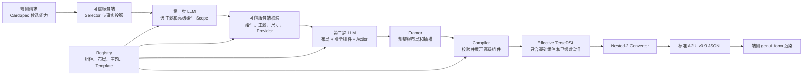

# 高级组件生成、展开与 A2UI 输出流程示意

> 适用接口：`generateWidgetCardTerseDslNested2`。
>
> 名词约定：本文将口头所说的 “tesel” 统一写成代码中的正式名称 **TerseDSL**。
>
> 示例证据：2026-08-12 正式批跑 `2x2-q20`（深圳天气）及 `2x2-q7`（雨天通勤）。

## 1. 一张图看完整链路



边界必须明确：

- LLM 只做语义选择和组合，不直接定义高级组件内部结构。
- `WeatherOverview`、`SingleFocusLayout`、`IconAction` 都是生成期语义节点，不是端侧 A2UI Catalog 组件。
- 高级组件必须先被服务端确定性展开为基础 TerseDSL，才能转换为 A2UI。
- 最终 A2UI 中不允许残留 `Template`、高级布局、高级 Action 或业务高级组件名称。

## 2. 三层表达分别是什么

| 层级 | 示例 | 谁产生 | 能否下发端侧 |
| --- | --- | --- | --- |
| Scope | `WeatherOverview` + `family-weather-care-blue` | 第一步 LLM | 否 |
| 高级 TerseDSL | `SingleFocusLayout(WeatherOverview(...), IconAction(...))` | 第二步 LLM | 否 |
| Effective TerseDSL | `Column`、`Stack`、`Row`、`Text`、`Image` | 服务端 Compiler | 否，仅作为转换输入 |
| A2UI v0.9 | `createSurface`、`updateComponents`、`updateDataModel` | Nested-2 Converter | 是 |

业务高级组件目前有两种实现方式，但安全边界相同：

1. `implementation: "terse-dsl"`：第二步输出受限直接业务调用，例如
   `WeatherOverview({...})`；Compiler 根据可信事实展开。
2. `implementation: "template"`：第二步输出批准的
   `Template("template-id@version", "variant", {...})`；Compiler 用本地 Registry
   中的版本化蓝图展开。

两种路径都不会把模板定义或高级组件定义交给模型，也不会把高级节点下发端侧。

## 3. q20 深圳天气：完整输入输出

### 3.1 端侧请求输入

下面是批跑产物 `cases/2x2-q20/input.json` 的关键字段：

```json
{
  "title": "深圳天气",
  "description": "深圳天气速览",
  "size": "2x2",
  "userQuery": "使用2*2规格，创建深圳天气卡片，展示深圳当前天气信息，包括温度、天气状况、体感温度、湿度等，极端天气时标红提醒，并集成一键打电话功能",
  "candidateDataBindings": [
    {
      "capabilityId": "ViewWeather",
      "arguments": { "districtName": "深圳", "forecastDays": 1 },
      "writeResultTo": "/data/weather"
    }
  ],
  "candidateAssetIds": [
    "asset.sun_max",
    "asset.drop_1",
    "asset.thermometer_sun_fill",
    "asset.phone_fill"
  ],
  "candidateEventCandidates": [
    {
      "capabilityId": "event.call.phone",
      "action": {
        "call": "clickToApi",
        "args": {
          "intentName": "CallPhone",
          "params": { "phoneNumber": "", "relationship": "父母" }
        }
      }
    }
  ]
}
```

请求只携带候选能力、素材和事件，不允许第二步 LLM 自行补造业务事实。

### 3.2 服务端 Selector 与事实投影

`apply_content_selectors` 和 `project_content_component_facts` 将 Provider 数据收敛为本次
高级组件可见的最小可信事实。q20 投影结果为：

```json
{
  "size": "2x2",
  "dataModelSchema": {
    "data": {
      "WeatherOverview": {
        "city": { "type": "string", "sampleValue": "深圳" },
        "temperature": { "type": "string", "sampleValue": "26℃" },
        "condition": { "type": "string", "sampleValue": "多云" },
        "airQuality": { "type": "string", "sampleValue": "优" },
        "temperatureRange": { "type": "string", "sampleValue": "24℃ / 31℃" }
      }
    }
  },
  "assetCandidates": [
    { "id": "asset.sun_max", "src": "resources/base/media/sun_max.svg" },
    { "id": "asset.phone_fill", "src": "resources/base/media/phone_fill.svg" }
  ],
  "eventCandidates": [
    {
      "id": "event.call.phone",
      "call": "clickToApi",
      "args": {
        "intentName": "CallPhone",
        "params": { "phoneNumber": "", "relationship": "父母" }
      }
    }
  ]
}
```

本次批跑诊断中的 `temporaryDataAdmissionBypass` 为 `true`。它只表示批量测试允许使用候选
Schema 的样例事实验证布局链路，不代表线上 Provider 取数成功；排查“数据丢失”时应同时查看
原始 `input.json`、`projectedTaskSpec` 和最终 A2UI 的可见文本，不能只看第二步输出。

### 3.3 第一步 LLM：确定 Scope

第一步只允许输出固定 Schema，不输出布局、参数和基础组件：

```json
{
  "scopeVersion": "advanced-scope-brief/1",
  "themeId": "family-weather-care-blue",
  "advancedComponentIds": ["WeatherOverview"]
}
```

服务端随后校验：

- `WeatherOverview` 是否在 Registry 注册；
- `ViewWeather` 是否支持当前变体；
- `2x2` 是否满足组件面积和信息预算；
- 主题是否属于已选业务组件允许的 Palette Scene；
- 至少存在一个兼容布局。

任何一项不满足都会在进入第二步前失败，不会让第二步绕过 Scope。

### 3.4 第二步 LLM：组织布局、业务组件和动作

第二步接收的 Contract 只暴露已批准内容：兼容布局 ID、`WeatherOverview` 参数 Schema、可信
字符串、可信素材路径、`event.call.phone` 以及主题。q20 的真实输出为：

```typescript
SingleFocusLayout(
  WeatherOverview({
    "variant": "current",
    "role": "hero",
    "conditionIcon": "resources/base/media/sun_max.svg"
  }),
  IconAction({
    "actionId": "event.call.phone",
    "icon": "resources/base/media/phone_fill.svg"
  })
);
```

这一步只决定“单焦点天气 + 右下角图标动作”。城市、温度、天气状态等内容没有写在模型
输出里，它们由 Compiler 从 `projectedTaskSpec` 注入，因此不能仅凭第二步文本判断数据是否丢失。

## 4. 高级组件如何展开成 Effective TerseDSL

### 4.1 展开映射

| 高级节点 | 服务端展开职责 | q20 的基础结构 |
| --- | --- | --- |
| `SingleFocusLayout` | 生成主内容层和覆盖层，分配 Action 插槽 | 根 `Stack` + 主内容 `Stack` + Action `Stack` |
| `WeatherOverview` | 读取五个可信天气事实，决定字号、间距和图标色 | `Column(Row(Text, Image), Text, Column(Row(...), Text))` |
| `IconAction` | 根据 `actionId` 绑定真实调用和参数 | 带 `onClick` 的圆形 `Stack` + `Image` |
| `family-weather-care-blue` | 统一根背景、渐变、前景文字和图标角色色 | 蓝色渐变 `Column("card", ...)` |

### 4.2 q20 当前 Compiler 的实际展开结果

下面是用同一份 q20 Scope、投影事实和第二步输出，在当前 Compiler 复算得到的完整
`effective_output`。为便于阅读只做了换行和缩进，节点与参数未改写：

```typescript
Column("card", {
  "backgroundColor":"#FF317AF7",
  "borderRadius":20,
  "padding":12,
  "linearGradient":{
    "direction":"Bottom",
    "colors":[["#FF317AF7",0],["#FF46B1E3",1]]
  },
  "clip":true,
  "itemMargin":8,
  "_id":"root"
},
  Stack("overlay", {"width":"matchParent","height":"matchParent"},
    Stack("overlay", {
      "width":"matchParent",
      "height":"matchParent",
      "alignContent":"topStart"
    },
      Column("compact", {
        "width":"matchParent",
        "height":"matchParent",
        "itemMargin":4,
        "justifyContent":"start",
        "alignItems":"start",
        "clip":true
      },
        Column("compact", {
          "width":"matchParent",
          "height":"matchParent",
          "itemMargin":2,
          "justifyContent":"spaceBetween",
          "alignItems":"start",
          "clip":true,
          "constraintSize":{"minWidth":0,"minHeight":0}
        },
          Row("between", {
            "width":"matchParent",
            "height":32,
            "itemMargin":4,
            "justifyContent":"spaceBetween",
            "alignItems":"top",
            "clip":true
          },
            Text("深圳", "compact-title", {
              "fontSize":12,
              "fontWeight":600,
              "maxLines":1,
              "textOverflow":"ellipsis",
              "constraintSize":{"minWidth":0,"minHeight":0},
              "layoutWeight":1,
              "fontColor":"#FFFFFFFF"
            }),
            Image("resources/base/media/sun_max.svg", "icon", {
              "width":32,
              "height":32,
              "objectFit":"contain",
              "flexShrink":0,
              "fillColor":"#FFFFC300"
            })
          ),
          Text("26℃", "title", {
            "fontSize":38,
            "fontWeight":800,
            "maxLines":1,
            "textOverflow":"ellipsis",
            "constraintSize":{"minWidth":0,"minHeight":0},
            "minFontSize":38,
            "fontColor":"#FFFFFFFF"
          }),
          Column("compact", {
            "width":"matchParent",
            "itemMargin":2,
            "alignItems":"start",
            "padding":{"left":0,"top":0,"right":38,"bottom":0}
          },
            Row("between", {
              "width":"matchParent",
              "itemMargin":4,
              "justifyContent":"start",
              "alignItems":"center"
            },
              Text("多云", "body", {
                "fontSize":14,
                "fontWeight":500,
                "maxLines":1,
                "textOverflow":"ellipsis",
                "constraintSize":{"minWidth":0,"minHeight":0},
                "fontColor":"#FFFFFFFF"
              }),
              Text("优", "body", {
                "fontSize":14,
                "fontWeight":500,
                "maxLines":1,
                "textOverflow":"ellipsis",
                "constraintSize":{"minWidth":0,"minHeight":0},
                "fontColor":"#FFFFFFFF"
              })
            ),
            Text("24℃ / 31℃", "subtitle", {
              "fontSize":12,
              "fontWeight":400,
              "maxLines":1,
              "textOverflow":"ellipsis",
              "constraintSize":{"minWidth":0,"minHeight":0},
              "fontColor":"#FFFFFFFF"
            })
          )
        )
      )
    ),
    Stack("overlay", {
      "width":"matchParent",
      "height":"matchParent",
      "alignContent":"bottomEnd"
    },
      Stack("overlay", {
        "width":30,
        "height":30,
        "borderRadius":15.0,
        "backgroundColor":"#FFFFFFFF",
        "alignContent":"center",
        "onClick":[{
          "call":"clickToApi",
          "args":{
            "intentName":"CallPhone",
            "params":{"phoneNumber":"","relationship":"父母"}
          }
        }]
      },
        Image("resources/base/media/phone_fill.svg", "icon", {
          "width":16,
          "height":16,
          "objectFit":"contain",
          "fillColor":"#FF64BB5C"
        })
      )
    )
  )
);
```

展开后可直接验证四件事：

1. `WeatherOverview` 已消失，天气事实变成基础 `Text`/`Image`。
2. `SingleFocusLayout` 已消失，布局变成基础 `Stack`/`Column`。
3. `IconAction` 已消失，动作变成带可信 `onClick` 的基础 `Stack`。
4. 主题颜色由服务端注入，第二步模型不能随意写背景色或控件色。

## 5. Effective TerseDSL 如何变成 A2UI

Nested-2 Converter 为每个基础节点分配稳定组件 ID，并生成三类 JSONL 消息：

```jsonl
{"version":"v0.9","createSurface":{"surfaceId":"surface_card","catalogId":"ohos.a2ui.extended.catalog"}}
{"version":"v0.9","updateComponents":{"surfaceId":"surface_card","root":"root","components":[
  {"id":"root","component":"Column","children":["root_0"],"styles":{"padding":12,"borderRadius":20,"backgroundColor":"#FF317AF7","linearGradient":{"direction":"Bottom","colors":[["#FF317AF7",0],["#FF46B1E3",1]]}}},
  {"id":"root_0_0_0_0_0_0","component":"Text","content":"深圳","styles":{"fontSize":12,"fontColor":"#FFFFFFFF"}},
  {"id":"root_0_0_0_0_0_1","component":"Image","src":"resources/base/media/sun_max.svg","styles":{"width":32,"height":32,"fillColor":"#FFFFC300"}},
  {"id":"root_0_0_0_0_1","component":"Text","content":"26℃","styles":{"fontSize":38,"fontColor":"#FFFFFFFF"}},
  {"id":"root_0_1_0","component":"Stack","onClick":[{"call":"clickToApi","args":{"intentName":"CallPhone","params":{"phoneNumber":"","relationship":"父母"}}}]},
  {"id":"root_0_1_0_0","component":"Image","src":"resources/base/media/phone_fill.svg","styles":{"width":16,"height":16,"fillColor":"#FF64BB5C"}}
]}}
{"version":"v0.9","updateDataModel":{"surfaceId":"surface_card","path":"/","value":{"ui":{"state":"ready"}}}}
```

上面是便于阅读的关键节点节选；正式产物中的 `updateComponents.components` 是一行完整 JSON，
并包含所有父子关系与样式。

## 6. q7：Framer 如何修正第二步结构

q7 第一步选择三个高级组件：

```json
{
  "scopeVersion":"advanced-scope-brief/1",
  "themeId":"rainy-commute-gray-blue",
  "advancedComponentIds":[
    "WeatherOverview",
    "BatteryOverview",
    "LocationOverview"
  ]
}
```

第二步 LLM 原始输出把 `BatteryOverview` 额外包进了一个 `Column`：

```typescript
HeroSupportActionLayout(
  {"heroRatio":"wide"},
  WeatherOverview({"variant":"current","role":"hero","conditionIcon":"resources/base/media/drop_1.svg"}),
  Column("compact",
    BatteryOverview({"variant":"charging","role":"support","batteryIcon":"resources/base/media/bolt_fill.svg","showTitle":false}),
    Text("68%", "body")
  ),
  PillAction({"actionId":"event.startNavigate","icon":"resources/base/media/location_north_up_right_fill.svg"})
);
```

`frame_ux_layout_root_children` 只做可证明安全的结构规整，得到实际送入 Compiler 的
`precompileDsl`：

```typescript
HeroSupportActionLayout(
  {"heroRatio":"wide"},
  WeatherOverview({"variant":"current","role":"hero","conditionIcon":"resources/base/media/drop_1.svg"}),
  BatteryOverview({"variant":"charging","role":"support","batteryIcon":"resources/base/media/bolt_fill.svg","showTitle":false}),
  IconAction({"actionId":"event.startNavigate","icon":"resources/base/media/location_north_up_right_fill.svg"})
);
```

这里展示了两个确定性修正：

- 删除破坏布局插槽契约的冗余包装及重复电量文本，电量仍由可信 `BatteryOverview` 展开。
- 将当前尺寸和天气场景下的带图标 `PillAction` 规整为安全的 `IconAction` 插槽。

Framer 不会创造新的业务事实、素材、Action 或颜色。无法安全规整的输出会进入第二步重试，超过
`ux_mixed_validation_max_retry_attempts` 后返回失败。

## 7. 校验、重试和失败边界

Compiler 按以下顺序处理：

1. 解析高级 TerseDSL，并规范化少量无歧义模型错误。
2. 校验根布局、原始组件预算、嵌套深度、可信字面量、素材、Action 和必需业务组件。
3. 展开直接业务组件和本地 Template。
4. 下沉高级布局和 Action，注入业务标题，去重并约束内容高度。
5. 编译根主题外壳，统一前景文字和图标角色色。
6. 去除内部高级组件标记，再校验展开后组件预算和树结构。
7. 序列化 Effective TerseDSL 并转换 A2UI。
8. 断言最终 A2UI 中没有任何高级节点泄漏。

发生严格契约错误时，只允许第二步 LLM 基于原 Contract 重新生成。第一步 Scope 不变，也不允许
降级到旧整卡模板路径。当前 `generateWidgetCardTerseDslNested2` 创建流程会直接进入严格混合方案；
`forceHybridTemplate` 仅是本地/测试环境受权绕过开关，不负责决定是否走混合方案。

## 8. 批跑结果如何定位每一阶段

每条用例目录都应保留：

| 文件 | 含义 |
| --- | --- |
| `input.json` | 端侧实际请求 |
| `llm-step-01-advanced-component-scope-input.jsonl` | 第一步 LLM 输入 |
| `llm-step-01-advanced-component-scope.txt` | 第一步 LLM 输出 |
| `llm-step-02-advanced-mixed-body-input.jsonl` | 第二步 LLM 输入 |
| `llm-step-02-advanced-mixed-body.txt` | 第二步 LLM 原始输出 |
| `diagnostics.json` | `projectedTaskSpec`、`precompileDsl`、修复次数和覆盖率 |
| `output.a2ui.jsonl` | 最终下发端侧的 A2UI |
| `metrics.json` | 状态、错误码和耗时 |
| `response.json` | 接口响应摘要 |

q20 本次结果为 `success`，耗时 `2970.3 ms`。排查某个字段为何没有显示时，建议按下面顺序对照：

```text
input.json
  -> diagnostics.projectedTaskSpec
  -> 第二步 Contract / 原始输出
  -> diagnostics.precompileDsl
  -> output.a2ui.jsonl
  -> 端侧截图与 hilog
```

## 9. 代码入口

- 路由与严格混合方案入口：
  `widget_service/cloud/services/widget_generation_service.py`
- 两步生成编排：
  `widget_service/cloud/services/advanced_component_pipeline/pipeline.py`
- 第一步 Scope 选择与校验：
  `widget_service/cloud/services/advanced_component_pipeline/scope_planner.py`
- 第二步 Contract 和 Prompt：
  `widget_service/cloud/services/advanced_component_pipeline/ux_mixed_prompt.py`
- 根布局规整：
  `widget_service/cloud/services/advanced_component_pipeline/ux_mixed_framer.py`
- 高级组件展开、主题外壳和 TerseDSL 序列化：
  `widget_service/cloud/services/cardplan_template/compiler.py`
- TerseDSL-Nested-2 到 A2UI：
  `widget_service/cloud/services/terse_dsl_nested2_converter.py`
- 业务高级组件说明：
  [`advanced-business-components-wiki.md`](advanced-business-components-wiki.md)
- 布局高级组件说明：
  [`advanced-layout-components-wiki.md`](advanced-layout-components-wiki.md)

