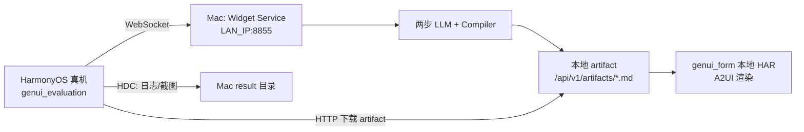

# Widget Service 本地部署与真机调试 Wiki

> 适用范围：在 macOS 上启动 `widget_service`，使用 HarmonyOS 真机运行
> `genui_evaluation`，调试 `generateWidgetCardTerseDslNested2`、批量用例、A2UI 下载与渲染。
>
> 网络约定：**不使用 HDC 端口反向映射**。真机通过 Mac 的局域网 IP 直接访问服务；HDC 只用于
> 选择设备、安装 HAP、启动 Ability、抓取 hilog、布局和截图。

## 1. 调试链路



真机调试能完整闭环的前提是两个地址都可从设备访问：

1. WebSocket：
   `ws://<MAC_LAN_IP>:8855/api/v1/ws/tools/generateWidgetCardTerseDslNested2`
2. artifact：
   `http://<MAC_LAN_IP>:8855/api/v1/artifacts/artifact_<uuid>.md`

只修改 WebSocket 地址是不够的。若 `WIDGET_SERVICE_ARTIFACT_BASE_URL` 仍是
`127.0.0.1`、`obs.todo.local` 或其它真机不可达地址，生成会成功，但端侧会在下载产物阶段失败。

## 2. 目录与工具

本文命令基于以下目录：

```text
/Users/yansf/workspace/GenerateUI/CreateMyCard
/Users/yansf/workspace/GenerateUI/genui_evaluation
/Users/yansf/workspace/GenerateUI/result
```

推荐环境：

- Python 3.12 或更高版本；
- DevEco Studio 自带 Node、Hvigor、HarmonyOS SDK 和 HDC；
- Mac 与真机处于互相可达的受控局域网；
- 真机已开启 USB 调试并信任当前 Mac；
- 端侧使用 `entry/libs/genui_form.har`，而不是在线 OHPM 版本。

当前工程中常用工具路径：

```bash
HDC=/Applications/DevEco-Studio.app/Contents/sdk/default/openharmony/toolchains/hdc
NODE=/Applications/DevEco-Studio.app/Contents/tools/node/bin/node
HVIGOR=/Applications/DevEco-Studio.app/Contents/tools/hvigor/bin/hvigorw.js
OHPM=/Applications/DevEco-Studio.app/Contents/tools/ohpm/bin/ohpm
```

## 3. 获取 Mac 局域网 IP

优先查看当前 Wi-Fi 接口：

```bash
ipconfig getifaddr en0
```

若无输出，再用以下命令确认当前活动接口：

```bash
networksetup -listallhardwareports
ifconfig | rg '^[a-z0-9]+:|inet '
```

将得到的地址记为 `<MAC_LAN_IP>`。不要把以下地址写给真机：

- `127.0.0.1`：在真机上表示真机自身；
- `localhost`：同样指向真机自身；
- Docker 容器内部 IP：通常不能由真机直接访问；
- 会随 VPN 切换且设备不可达的虚拟网卡地址。

Mac 和真机切换 Wi-Fi、VPN 或热点后，局域网 IP 可能变化，需要同步更新端侧配置并重新构建 HAP。

## 4. 准备本地服务配置

### 4.1 创建忽略的 `.env`

```bash
cd /Users/yansf/workspace/GenerateUI/CreateMyCard/widget_service
cp .env.example .env
chmod 600 .env
```

`.env` 已被版本控制忽略。不要把 Token、模型凭据或真实服务地址写入 Wiki、提交记录、终端共享日志
或 PR 描述。

### 4.2 真机联调必需配置

编辑 `widget_service/.env`，至少确认：

```dotenv
WIDGET_SERVICE_ENV=local
# 同时允许 Mac 本机和局域网真机访问。
WIDGET_SERVICE_SERVER_HOST=0.0.0.0
WIDGET_SERVICE_SERVER_PORT=8855

# 返回给真机的本地 artifact 下载前缀；必须包含 /api/v1/artifacts。
WIDGET_SERVICE_ARTIFACT_BASE_URL=http://<MAC_LAN_IP>:8855/api/v1/artifacts

# 使用随机调试令牌；端侧 pairingCode 必须与它完全一致。
WIDGET_SERVICE_WEBSOCKET_BEARER_TOKEN=<LOCAL_DEBUG_TOKEN>

WIDGET_SERVICE_ENABLE_ARTIFACT_VALIDATION=true
WIDGET_SERVICE_ENABLE_VALIDATION_FAILURE_RETRY=false
```

`0.0.0.0` 会让服务监听所有网卡，便于同时从 Mac 本机和真机验证。即使 WebSocket 有 Bearer Token，
本地 artifact 下载接口仍是通过不可猜 UUID 隔离的明文 HTTP 调试入口，因此只应在受控网络使用，并由
macOS 防火墙限制外部访问。需要缩小监听范围时，可以改为当前 `<MAC_LAN_IP>`；此时
`http://127.0.0.1:8855/health` 不一定可用，应使用局域网 IP 检查。

### 4.3 模型模式

只验证网络、WebSocket 包络和页面流程时，可使用 mock：

```dotenv
WIDGET_SERVICE_ENABLE_A2UI_MODEL_MOCK=true
```

验证真实两步 LLM、高级组件和视觉效果时使用：

```dotenv
WIDGET_SERVICE_ENABLE_A2UI_MODEL_MOCK=false
WIDGET_SERVICE_DESIGN_COMPACT_MODEL_BACKEND=openai
```

第五接口使用 `WIDGET_SERVICE_DESIGN_COMPACT_MODEL_BACKEND`。真实模式还需在忽略的本地配置中提供
当前环境所需的 DeepSeek Platform/llmclient 连接信息；凭据不应进入本文。启动日志应能看到
`advanced-component-scope` 和 `advanced-mixed-body` 两个模型阶段。

### 4.4 批量用例配置

只调单条正式请求时保持批测开关关闭。运行端侧批量页时增加：

```dotenv
WIDGET_SERVICE_ENABLE_WIDGET_BATCH_RECORDING=true
WIDGET_SERVICE_WIDGET_BATCH_RESULTS_PATH=workspace/widget_batch_runs
```

若需要用完整受控 Schema 样例观察 20/10 条用例的视觉效果，可临时开启：

```dotenv
WIDGET_SERVICE_ENABLE_ADVANCED_COMPONENT_DATA_ADMISSION_BYPASS_FOR_BATCH=true
```

该开关只有在合法 `batchId/caseId/size` 的批测请求中才生效，不会改变普通请求。但它属于评测准入
放宽，批跑结束后应恢复为 `false`。

## 5. 安装依赖并启动服务

### 5.1 首次安装

```bash
cd /Users/yansf/workspace/GenerateUI/CreateMyCard/widget_service
python3 --version
python3 -m venv .venv
source .venv/bin/activate
python --version
python -m pip install -U pip
python -m pip install -e '.[dev]'
```

两个版本输出都应为 3.12 或更高。若已有 `.venv`，只需激活并在依赖变化后重新执行最后一条安装命令；
若虚拟环境的 Python 版本不符合要求，删除并重建该虚拟环境，不要用系统包覆盖解释器。

### 5.2 启动

必须从 `widget_service` 目录启动，确保 Pydantic 能读取当前目录下的 `.env`：

```bash
cd /Users/yansf/workspace/GenerateUI/CreateMyCard/widget_service
source .venv/bin/activate
python cloud/start_websocket_server.py
```

保持该终端不退出。业务日志同时写入：

```text
widget_service/cloud/logs/agent_YYYYMMDD.log
```

代码没有自动 reload；修改 Python、配置、Prompt 或 Registry 后，应停止当前进程并重新启动。

### 5.3 本机健康检查

在另一个终端执行：

```bash
curl -fsS http://127.0.0.1:8855/health
curl -fsS http://<MAC_LAN_IP>:8855/health
lsof -nP -iTCP:8855 -sTCP:LISTEN
```

预期健康检查均返回：

```json
{"status":"ok"}
```

若 `127.0.0.1` 成功而局域网 IP 失败，优先检查：

- `WIDGET_SERVICE_SERVER_HOST` 是否仍为 `127.0.0.1`，而不是 `0.0.0.0` 或当前局域网 IP；
- `.env` 是否放在 `widget_service/.env`，启动目录是否正确；
- macOS 防火墙是否阻止 Python 接收入站连接；
- 当前 `<MAC_LAN_IP>` 是否来自真机可达的实际接口。

最后在真机浏览器访问：

```text
http://<MAC_LAN_IP>:8855/health
```

真机看到 `{"status":"ok"}` 后再继续构建 App，可把问题明确分离为“网络/防火墙”或“端侧应用”。

## 6. 配置端侧直连本地服务

编辑被 `.gitignore` 忽略的文件：

```text
/Users/yansf/workspace/GenerateUI/genui_evaluation/
entry/src/main/resources/rawfile/remote_benchmark_config.json
```

批量页最小配置：

```json
{
  "widgetNested2WebSocketUrl": "ws://<MAC_LAN_IP>:8855/api/v1/ws/tools/generateWidgetCardTerseDslNested2",
  "pairingCode": "<LOCAL_DEBUG_TOKEN>"
}
```

若还要调试其它页面，可使用：

```json
{
  "webSocketUrl": "ws://<MAC_LAN_IP>:8855/ws",
  "cardTemplateWebSocketUrl": "ws://<MAC_LAN_IP>:8855/ws",
  "widgetNested2WebSocketUrl": "ws://<MAC_LAN_IP>:8855/api/v1/ws/tools/generateWidgetCardTerseDslNested2",
  "pairingCode": "<LOCAL_DEBUG_TOKEN>"
}
```

注意：配置文件会被打包进入 HAP。地址或 Token 变化后需要重新构建并覆盖安装；不要仅修改源码后继续
使用旧 HAP。调试结束后不要分享含令牌的 HAP。

## 7. 确认使用本地 genui_form HAR

`genui_evaluation/entry/oh-package.json5` 应包含：

```json5
"@arkui-genius/genui_form": "file:libs/genui_form.har"
```

并确认文件存在：

```bash
ls -lh /Users/yansf/workspace/GenerateUI/genui_evaluation/entry/libs/genui_form.har
```

若刚替换 HAR，重新安装依赖并构建：

```bash
cd /Users/yansf/workspace/GenerateUI/genui_evaluation
/Applications/DevEco-Studio.app/Contents/tools/ohpm/bin/ohpm install --all
```

本地 HAR 修复了在线包中部分 margin/padding 能力缺失问题。批量页和其它页面共用依赖，不能只替换
单个页面的导入。

## 8. 构建 HAP

```bash
cd /Users/yansf/workspace/GenerateUI/genui_evaluation

DEVECO_SDK_HOME=/Applications/DevEco-Studio.app/Contents/sdk \
JAVA_HOME=/Applications/DevEco-Studio.app/Contents/jbr/Contents/Home \
/Applications/DevEco-Studio.app/Contents/tools/node/bin/node \
/Applications/DevEco-Studio.app/Contents/tools/hvigor/bin/hvigorw.js \
--mode module -p module=entry@default -p product=default \
-p requiredDeviceType=phone assembleHap \
--analyze=normal --parallel --incremental --no-daemon
```

预期产物：

```text
entry/build/default/outputs/default/entry-default-signed.hap
```

构建后检查时间和大小，避免安装旧包：

```bash
ls -lh entry/build/default/outputs/default/entry-default-signed.hap
```

## 9. 选择真机、安装和启动

先检查 HDC 与设备状态：

```bash
HDC=/Applications/DevEco-Studio.app/Contents/sdk/default/openharmony/toolchains/hdc
$HDC -v
$HDC list targets -v
```

将目标行第一列记为 `<DEVICE_KEY>`。即使当前只有一台设备，后续安装、启动、日志和文件操作也建议
始终显式使用 `-t`：

```bash
$HDC -t <DEVICE_KEY> shell echo ok

$HDC -t <DEVICE_KEY> install -r \
  /Users/yansf/workspace/GenerateUI/genui_evaluation/entry/build/default/outputs/default/entry-default-signed.hap

$HDC -t <DEVICE_KEY> shell aa start \
  -a EntryAbility \
  -b com.example.genuievaluation
```

预期安装和启动均返回成功。本文流程不执行 `hdc rport`、`hdc fport` 或其它端口映射命令。

常见设备状态：

- `Unauthorized`：在真机上接受并尽量选择永久信任，再重查 targets；
- `Offline`：重新连接 USB，清除失效 TCP 目标；
- `[Empty]`：检查 USB 调试、数据线、SDK HDC 路径和 `hdc checkserver`；
- 多设备：所有变更命令都必须带正确的 `-t <DEVICE_KEY>`。

## 10. 真机运行批量用例

1. 打开 `genui_evaluation`。
2. 进入“Nested-2 卡片批量用例”页面。
3. 确认页面显示的 WebSocket 地址是 `<MAC_LAN_IP>:8855`，不是公网地址或 `127.0.0.1`。
4. 确认 Bearer Token 已从 `pairingCode` 读取，或在页面手工输入。
5. 选择 `2×2` 或 `2×4`。
6. 点击“运行当前批次”。
7. 等待逐条完成，不要在中途反复点击启动新批次。

当前尺寸规范：

- 2×2：20 条，每行 4 张，卡片 `160 × 160 vp`；
- 2×4：10 条，每行 2 张，卡片 `320 × 160 vp`。

每次运行会生成新的 `batchId`，例如 `nested2-2x2-<timestamp>`。端侧显示耗时用于现场观察，报告
以服务端 `metrics.json.durationMs` 为准。

## 11. 同时抓取服务端和端侧日志

### 11.1 服务端

实时查看本地文件日志：

```bash
cd /Users/yansf/workspace/GenerateUI/CreateMyCard/widget_service
tail -f cloud/logs/agent_$(date +%Y%m%d).log
```

重点搜索：

```bash
rg 'advanced-component-scope|advanced-mixed-body|strict_ux_mixed_generation_failed|validation_error_code|artifact_uploaded|batch' \
  cloud/logs/agent_$(date +%Y%m%d).log
```

### 11.2 真机 hilog

先获取应用 PID：

```bash
HDC=/Applications/DevEco-Studio.app/Contents/sdk/default/openharmony/toolchains/hdc
DEVICE_KEY=<DEVICE_KEY>
PID=$($HDC -t "$DEVICE_KEY" shell 'pidof com.example.genuievaluation' | tr -d '\r\n')
echo "$PID"
```

启动聚焦日志并保持终端运行，然后在真机复现：

```bash
$HDC -t "$DEVICE_KEY" hilog -z 2500 -t app -P "$PID" \
  -e 'WidgetBatch|GenuiForm|rendered messages|schemaWarning|Surface|DSL root|WebSocket' \
  | tee /Users/yansf/workspace/GenerateUI/result/local-device-hilog.txt
```

正常单条卡片应出现类似：

```text
case=2x2-q1 surface=surface_card updated
case=2x2-q1 rendered messages=3
```

一条标准卡片通常依次处理 `createSurface`、`updateComponents`、`updateDataModel` 三条消息。若出现
`2004 DSL root must be an object`，先确认端侧仍使用本地 HAR，并确认消息数组已按对象逐条发送且顺序
正确。

## 12. 保存服务端批跑结果

先列出批次：

```bash
curl -fsS \
  -H 'Authorization: Bearer <LOCAL_DEBUG_TOKEN>' \
  http://<MAC_LAN_IP>:8855/api/v1/widget-batches \
  | jq .
```

下载指定批次：

```bash
BATCH_ID=nested2-2x2-<timestamp>
RESULT_DIR=/Users/yansf/workspace/GenerateUI/result/$BATCH_ID
mkdir -p "$RESULT_DIR"

curl -fsS \
  -H 'Authorization: Bearer <LOCAL_DEBUG_TOKEN>' \
  -o "$RESULT_DIR/server-result.zip" \
  "http://<MAC_LAN_IP>:8855/api/v1/widget-batches/$BATCH_ID/download"

unzip -q "$RESULT_DIR/server-result.zip" -d "$RESULT_DIR/server-result"
jq '.summary // {total: (.cases | length)}' "$RESULT_DIR/server-result/manifest.json"
```

每条 case 应至少包含：

```text
input.json
llm-step-01-advanced-component-scope-input.jsonl
llm-step-01-advanced-component-scope.txt
llm-step-02-advanced-mixed-body-input.jsonl
llm-step-02-advanced-mixed-body.txt
diagnostics.json
output.a2ui.jsonl
metrics.json
response.json
```

排查数据缺失时按以下顺序对照：

```text
input.json
 -> diagnostics.advancedPipelineEvidence.projectedTaskSpec
 -> 两步 LLM 输入/输出
 -> diagnostics.advancedPipelineEvidence.precompileDsl
 -> output.a2ui.jsonl
 -> 真机 hilog 和截图
```

## 13. 截图和布局树

用 HDC 触发真机截图并拉到结果目录：

```bash
HDC=/Applications/DevEco-Studio.app/Contents/sdk/default/openharmony/toolchains/hdc
DEVICE_KEY=<DEVICE_KEY>
RESULT_DIR=/Users/yansf/workspace/GenerateUI/result/$BATCH_ID

$HDC -t "$DEVICE_KEY" shell uitest screenCap \
  -p /data/local/tmp/widget-batch.png
$HDC -t "$DEVICE_KEY" file recv \
  /data/local/tmp/widget-batch.png \
  "$RESULT_DIR/widget-batch.png"
```

需要定位控件坐标、文本和滚动区域时，同时保存布局树：

```bash
$HDC -t "$DEVICE_KEY" shell uitest dumpLayout \
  -p /data/local/tmp/widget-batch-layout.json \
  -b com.example.genuievaluation
$HDC -t "$DEVICE_KEY" file recv \
  /data/local/tmp/widget-batch-layout.json \
  "$RESULT_DIR/widget-batch-layout.json"
```

多屏 Grid 建议分别保存 q1–q8、q9–q16、q13–q20 或对应 2×4 分屏截图，并在文件名中注明范围。

## 14. 可选：使用 Docker 启动

Python 进程方式更适合单步修改和看日志。需要验证容器部署时，在仓库根目录执行：

```bash
cd /Users/yansf/workspace/GenerateUI/CreateMyCard

docker build \
  -t widget-service:local-device \
  -f widget_service/Dockerfile \
  .

docker run --rm \
  --name widget-service-local-device \
  --env-file widget_service/.env \
  -e WIDGET_SERVICE_SERVER_HOST=0.0.0.0 \
  -p 8855:8855 \
  -v widget-service-local-workspace:/app/widget_service/cloud/workspace \
  widget-service:local-device
```

容器内必须监听 `0.0.0.0`，由 `-p 8855:8855` 发布到 Mac；端侧仍使用
`ws://<MAC_LAN_IP>:8855/...`。不要把端侧地址写成容器 IP。
命名卷会保留本地 artifact、批测结果和模型调用预算；批次仍通过 HTTP 下载接口导出，不需要直接读取
容器文件系统。

查看状态：

```bash
docker ps --filter name=widget-service-local-device
docker logs -f widget-service-local-device
curl -fsS http://<MAC_LAN_IP>:8855/health
```

## 15. 常见问题定位

| 现象 | 优先检查 |
| --- | --- |
| 真机浏览器打不开 `/health` | 服务监听地址、Mac IP、同网段、VPN、macOS 防火墙 |
| 页面仍连接公网或 `127.0.0.1` | `remote_benchmark_config.json` 是否已写入并重新构建、安装 HAP |
| WebSocket 返回 401 | `.env` Token 与端侧 `pairingCode` 是否逐字一致 |
| WebSocket 成功但 artifact 下载失败 | `WIDGET_SERVICE_ARTIFACT_BASE_URL` 是否为真机可达的 `/api/v1/artifacts` 前缀 |
| 批次 HTTP 接口返回 404 | `WIDGET_SERVICE_ENABLE_WIDGET_BATCH_RECORDING` 未开启或服务未重启 |
| 批次 HTTP 接口返回 401 | 下载请求未携带同一个 Bearer Token |
| 一直得不到模型响应 | 模型 mock/真实模式、模型地址/STS/网络、排队与请求超时、DeepSeek 调用预算 |
| `2004 DSL root must be an object` | 是否使用本地 HAR；A2UI 消息是否逐对象按三段顺序送入 |
| 全部显示“渲染失败” | HAP 是否仍依赖在线 OHPM 包；检查 `entry/oh-package.json5` 和 HAR 后重建 |
| `Surface 2001` 或 schema warning | 保存该 case 的 A2UI、diagnostics、hilog，检查组件属性和枚举 |
| 服务成功但页面无数据 | 对照 input、projectedTaskSpec、precompileDsl、A2UI 和端侧 DataModel 更新 |
| HDC `Unauthorized/Offline/[Empty]` | 先修复设备信任或连接状态，不要用端口映射掩盖设备问题 |

## 16. 调试结束与验收清单

停止本地服务使用启动终端中的 `Ctrl+C`。批跑完成后建议恢复：

```dotenv
WIDGET_SERVICE_ENABLE_ADVANCED_COMPONENT_DATA_ADMISSION_BYPASS_FOR_BATCH=false
WIDGET_SERVICE_ENABLE_WIDGET_BATCH_RECORDING=false
```

修改开关后重启服务才会生效。

不要提交或分享：

- `widget_service/.env`；
- `widget_service/env`；
- `remote_benchmark_config.json`；
- 带本地令牌的 HAP；
- 模型凭据或完整敏感请求日志。

一次完整真机验收至少满足：

- Mac 与真机 `/health` 均可访问；
- 未使用 HDC `rport/fport`；
- 端侧地址为当前 Mac 局域网 IP；
- WebSocket、artifact 下载均成功；
- 2×2 为 `160×160 vp`，2×4 为 `320×160 vp`；
- 每个成功 case 有三条 A2UI 消息并出现 `rendered messages=3`；
- 服务端批次 failed 为 0，或每个失败都有 diagnostics 和明确根因；
- hilog 中没有 `DSL root must be an object`、渲染失败或未解释的 Surface warning；
- 服务端 ZIP、真机 hilog、截图和布局树已归档到同一个 `result/<batchId>` 目录。

相关文档：

- [`advanced-component-pipeline-example-wiki.md`](advanced-component-pipeline-example-wiki.md)
- [`nested2-batch-e2e-fix-wiki.md`](nested2-batch-e2e-fix-wiki.md)
- [`cardplan_template_production.md`](cardplan_template_production.md)
